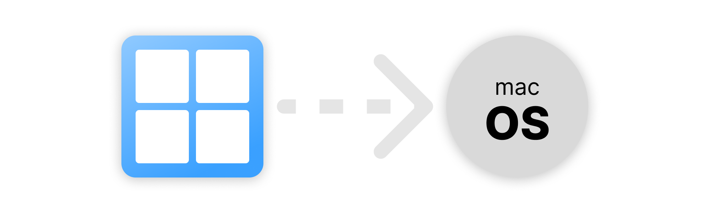

# I Bought Mac.
I was always a Windows or Linux user, but one nice afternoon I decided, that it would be nice to try Mac.  
So I bought one.

I would say, I was hardcore user of my laptop, and I love to have some kind of setup which I was using on all computers.  
So this repository is a documentation fo my hard work, to make macOS to my liking.

## History

- [Day 1 - Installation, Keyboard setup](/Pages/Day1-Installation,Keyboard.md)
- [Day 17 - Customization, Tools (Power Toys)](/Pages/Day17-Customization,Tools.md)
